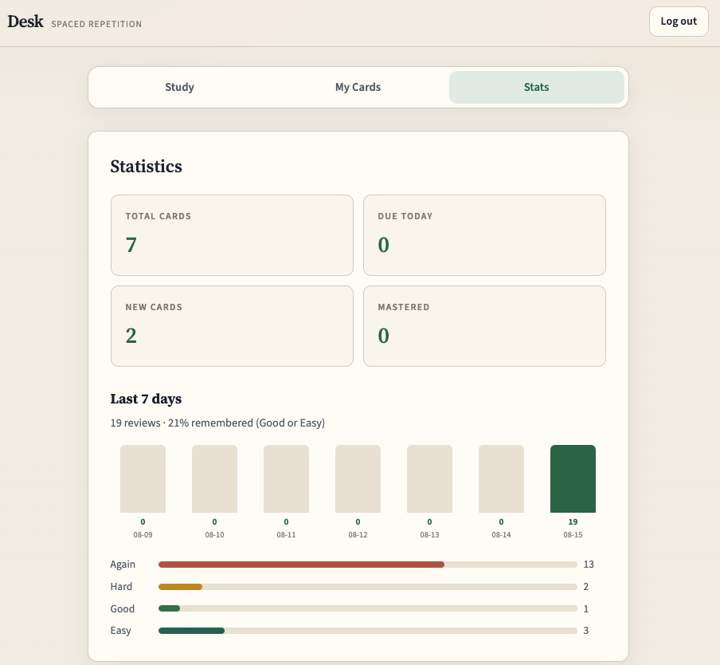

# Desk

Spaced-repetition flashcards: React + Express + MongoDB, JWT auth, and SuperMemo **SM-2** shared by the API and the UI.

**Live demo:** [GitHub Pages](https://josephkwok001.github.io/FlashCard-App/)  
The Pages build is the UI only — register/study need the API (local or deployed) pointed at MongoDB.


---

## Highlights

- **JWT auth** — register / login, bcrypt (cost 10), cards scoped by `userId` on the token
- **SM-2 scheduling** — Again / Hard / Good / Easy; same `shared/sm2.js` on the server and in the optimistic UI
- **Review history** — append-only `reviews` feeding last-7-days Stats
- **Optional AI assist** — OpenRouter suggestion for a card back

```
React (Vite)  →  Express API  →  MongoDB
     JWT in localStorage · Authorization: Bearer
     shared/ SM-2, Levenshtein, inverted index
```

---

## Screenshots




---

## Tech stack

| Layer | Tech |
|-------|------|
| Frontend | React 19, React Router, Vite |
| Backend | Node.js, Express |
| Database | MongoDB + Mongoose |
| Auth | JWT + bcryptjs |

---

## Run locally

**Prerequisites:** Node 18+. MongoDB Atlas **or** local MongoDB. Optional: OpenRouter key for AI Suggest.

1. Install and configure env:

```bash
npm install
cp .env.example .env
```

Set at least:

```
MONGODB_URI=mongodb://127.0.0.1:27017/flashcards
JWT_SECRET=...
PORT=5001
CLIENT_URL=http://localhost:5173
VITE_API_URL=http://localhost:5001/api
```

For Atlas, use the `mongodb+srv://…` URI instead.

2. If you are using the bundled local Mongo:

```bash
./scripts/start-mongo.sh
```

3. API and UI (two terminals):

```bash
npm run dev:server
npm run dev
```

4. Open `http://localhost:5173/my-project/`, register, add a few cards, then study.

```bash
npm test
```

More server detail: [SERVER_README.md](./SERVER_README.md)

---

## Algorithms

| Piece | Where | What it does |
|-------|--------|----------------|
| **SM-2** | `shared/sm2.js` | Passing grades: **1 day → 6 days → interval × ease**. Easy raises ease (later waits grow faster); Hard lowers it. **Again** resets the streak and sets `nextReview` to **+1 minute**. Quality buttons preview these delays. Used by `POST /api/cards/:id/rate` and the optimistic UI. |

`npm test` runs `shared/*.test.js` (Node built-in test runner).

---

## API (auth + cards)

| Method | Path | Notes |
|--------|------|--------|
| POST | `/api/auth/register` | Create user + JWT |
| POST | `/api/auth/login` | Email/password + JWT |
| GET/POST/PUT/DELETE | `/api/cards`… | Require `Authorization: Bearer <token>` |
| POST | `/api/cards/:id/rate` | Update SM-2 schedule + append review |
| GET | `/api/reviews/stats?days=7` | Per-day counts and quality split |

---

## Project layout

```
src/           React UI (pages, context, api client)
server/        Express routes, controllers, models, auth middleware
shared/        SM-2, Levenshtein, inverted index (used by UI + API)
docs/          README screenshots
scripts/       start-mongo.sh (optional local mongod)
```
