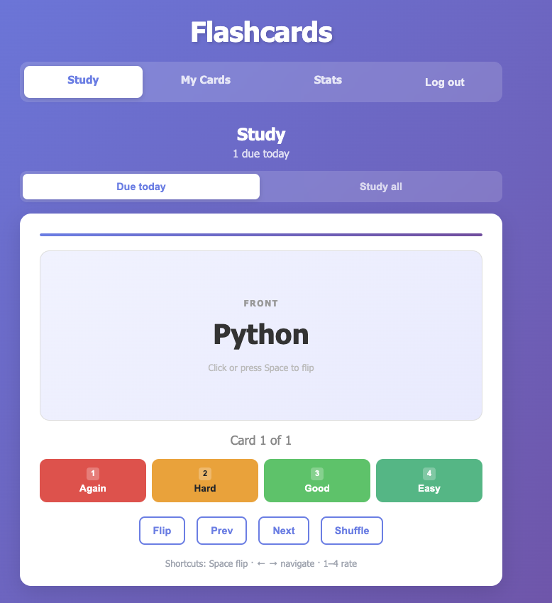
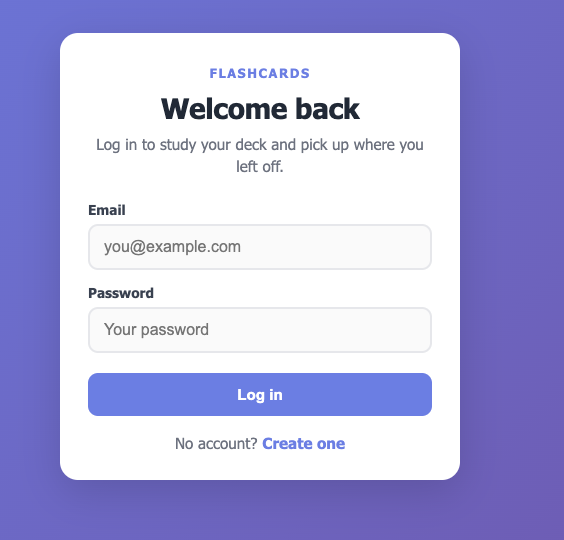
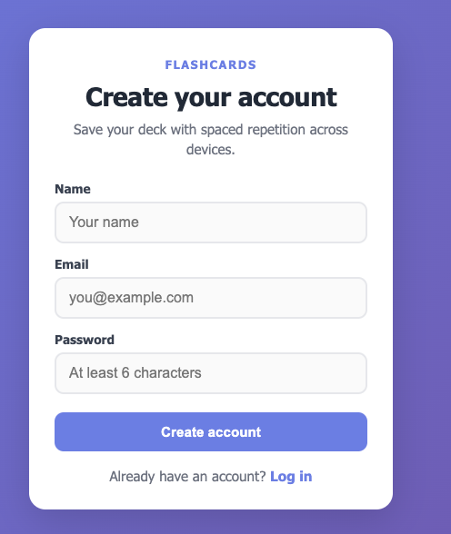
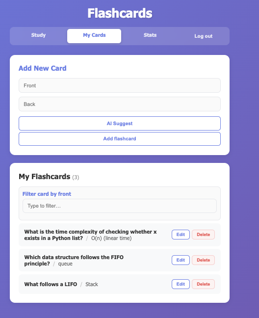

# Flashcards

Full-stack spaced-repetition flashcard app: React frontend, Express API, MongoDB, and JWT auth.

**Live demo:** [GitHub Pages](https://josephkwok001.github.io/my-project/)  
*(API must be running locally or deployed for login/cards to work against a backend.)*



---

## Highlights

- **JWT auth** — register / login, bcrypt password hashing, protected card routes
- **Spaced repetition** — SuperMemo SM-2 style scheduling (Again / Hard / Good / Easy)
- **Per-user decks** — cards scoped by `userId` from the token
- **React context + REST** — optimistic UI updates synced to Express/MongoDB
- **Optional AI assist** — OpenRouter suggestion for card backs

```
React (Vite)  →  Express API  →  MongoDB Atlas
     JWT in localStorage · Authorization: Bearer
```

---

## Screenshots





| Screen | File |
|--------|------|
| Hero / thumbnail | `docs/thumbnail.png` |
| Login | `docs/login.png` |
| Register | `docs/register.png` |
| Study | `docs/studyview.png` |

Still optional: `docs/cards.png`, `docs/stats.png` for My Cards and Stats.

---

## Tech stack

| Layer | Tech |
|-------|------|
| Frontend | React 19, React Router, Vite |
| Backend | Node.js, Express |
| Database | MongoDB + Mongoose |
| Auth | JWT + bcryptjs |

---

## Run locally

**Prerequisites:** Node 18+, MongoDB Atlas (or local MongoDB). Optional: OpenRouter API key for AI suggestions.

1. Install and configure env:

```bash
npm install
cp .env.example .env
```

Set at least:

```
MONGODB_URI=...
JWT_SECRET=...
PORT=5001
CLIENT_URL=http://localhost:5173
```

2. Start API and UI (two terminals):

```bash
npm run dev:server
npm run dev
```

3. Open the Vite URL (often `http://localhost:5173/my-project/`), register, then study.

More server detail: [SERVER_README.md](./SERVER_README.md)

---

## API (auth + cards)

| Method | Path | Notes |
|--------|------|--------|
| POST | `/api/auth/register` | Create user + JWT |
| POST | `/api/auth/login` | Email/password + JWT |
| GET/POST/PUT/DELETE | `/api/cards`… | Require `Authorization: Bearer <token>` |
| POST | `/api/cards/:id/rate` | Update SM-2 schedule |

---

## Project layout

```
src/           React UI (pages, context, api client)
server/        Express routes, controllers, models, auth middleware
```
